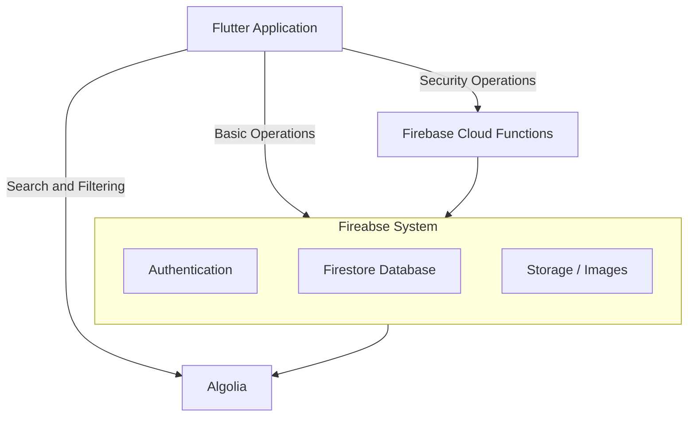
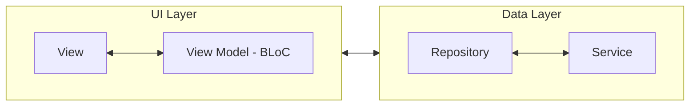

# Flashpedz - Smart flashcards and OSCE tests
Flashpedz is a mobile application designed to help medical students learn easier.
Two major features of the app are:
- Spaced Repetition learning with flashcards
- OSCE tests

App also includes admin panel, allowing admins to create new packs with flashcards and create OSCE tests,
as well as managing flashcards through reporting system.

Free and paid packs, as well as free and paid OSCE test exist, user needs to pay a monthly subscription in order
to access paid content.

# Table of Contents
- [Flashpedz - Smart flashcards and OSCE tests](#flashpedz---smart-flashcards-and-osce-tests)
- [Table of Contents](#table-of-contents)
- [System Architecture](#system-architecture)
    - [This github repository contains code for **Flutter Application** layer.](#this-github-repository-contains-code-for-flutter-application-layer)
- [How to Run (Production – Mobile Recommended)](#how-to-run-production--mobile-recommended)
  - [Prerequisites](#prerequisites)
  - [Platform Recommendation](#platform-recommendation)
    - [Step 1. Clone the project](#step-1-clone-the-project)
    - [Step 2. Run the flutter application](#step-2-run-the-flutter-application)
- [Flutter Application Architecture](#flutter-application-architecture)
  - [Data Layer](#data-layer)
  - [UI Layer](#ui-layer)
- [Auth Session Management](#auth-session-management)
- [User Profile Management](#user-profile-management)
- [How Does Spaced Repetition work with Flashcards?](#how-does-spaced-repetition-work-with-flashcards)
  - [What is spaced repetition?](#what-is-spaced-repetition)
  - [How is spaced repetition implemented in this project?](#how-is-spaced-repetition-implemented-in-this-project)
    - [Opening a pack will start the flashcard test](#opening-a-pack-will-start-the-flashcard-test)
  - [Bookmark test with flashcards](#bookmark-test-with-flashcards)
  - [Custom sessions with flashcards](#custom-sessions-with-flashcards)
- [How does OSCE tests work?](#how-does-osce-tests-work)


---

# System Architecture

### This github repository contains code for **Flutter Application** layer.



> Firebase system is composed of multiple managed services including authentication, database and storage, which together provide backend-as-a-service functionality.

> Algolia is connected to firebase system and it's used for fast text searching and filtering of data.

---

# How to Run (Production – Mobile Recommended)

## Prerequisites
- Flutter and its dependencies [Install Guide](https://docs.flutter.dev/install)
- Mobile device, physical or emulated
- Firebase project API key

> TODO: firebase project API key

## Platform Recommendation

The production flavour is **intended and tested primarily for Android/iOS**.
Running the application on Android/iOS (emulator or physical device) is **strongly recommended**.

### Step 1. Clone the project
```bash
git clone https://github.com/dile001/flashcards
cd flashcards
```

### Step 2. Run the flutter application
```bash
flutter run -t lib/main_prod.dart
```
This command:
- Uses main_prod.dart as the application entry point
- Runs the app with production configuration (Firebase, API endpoints, etc.)

> There is also a dev flavour but it's not working properly

---

# Flutter Application Architecture

We opted for _MVVM_-like architecture for this project. It ended up being a good idea since codebase grew fast.



> For more detailed explanation, check [Flutter Guide](https://docs.flutter.dev/app-architecture/guide)


Each of the layers have their own classes and are injected using **Dependency Injection (with *Provider* package)**. The order of injecting one layer to another is shown using arrows.

**Repository** can use multiple *Services*, **BLoC** can use multiple *Repositories*, but one **View** can only use one and deticated **View Model**.
Only one *View Model* belongs to one *View*.


## Data Layer

**Data Layer** provides abstraction layer of the data that the application uses, including:
- **Firestore data models** - every single collection in database has it's own _Service_ and _Repository_ implementation.
- **Firebase authentication** - responsible for managing user session
- **Firebase storage** - responsible for writing and accessing storage in a particular format, making it easier to understand and organize data
- **Algolia Search** - abstraction layer for using algolia search on databse models
- **Local Storage**, etc...

**Services** are responsible for calling external APIs and isolating those calls inside a function.
**Repositories** are using injected *services* and are responsible for business logic when it comes to data. 

This layer is located under ```lib/data```

Each repository usually has it's corresponding **Domain Model**, ex. *PackRespository* functions usually return *Pack* class.
Domain models are located under ```lib/domain/models```

Services are working with *dto* classes, they represent data structes that external API's return back. They are located under ```lib/services/api/dto```. Services usually return some sort of dto class, which are later used by repositories to convert from dto to domain model classes.


## UI Layer

**UI Layer** is responsible for rendering flutter UI components and managing UI business logic.

For UI business logic we are using **BLoC** package.

Every **View** (Page, Pop Up Alert, Bottom sheet...) has it's own **View Model class / BLoC** for managing UI business logic for that view.

**BLoC** layer is under ```lib/bloc```.

**View** layer is under ```lib/ui```

View layer uses **auto route** package for routing.

---

# Auth Session Management

**Firebase Authorization** is external service responsible for storing and managing user sessions.

Application uses **GLOBAL** ```Auth Bloc``` to manage UI state to allow or block certain content if user is logged in or not.

Global means that this service is injected directly into flutter's **context** using the *Provider* package. This way we can access user auth state anywhere in the **View layer**.

*Auth Bloc* can have these states:
- **Loading** - When app is waiting for auth async operation to finish
- **Unauthenticated** - User is not logged in and email is verified, he isredirected to login page
- **Authenticated** - User is logged in, he is redirected to home page.
- **VerifyEmailPending** - User registered on platform but didn't verify the email. Users must verify email before using the application. It that case, user gets redirected to *email verification* page

These *Bloc* states change based on the ```auth streams``` that *Firebase auth* service sends. When app starts, it subscribes to those auth streams, and based on the *Auth Bloc States* it redirects user to a deticated page explained above.

When user creates a new account, based on user information that he entered, a document inside ```users``` collection is created.

User can log out in many different ways, for that reason we also store ```sign out reason``` inside ```unauthenticated``` bloc state. Based on that, we can redirect user to a deticated page. For example:
- User manually logs out -> redirect to login page
- JWT token expires -> pop up page gets displayed to inform the user
- User deletes account -> redirect to "*good bye*" page
- User updates the email -> redirect to *verify email* page

---

# User Profile Management

Similarly to *Auth Session Management*, we have one global ```Profile Reader Cubit``` (Cubit is just simpler version of BLoC) that is injected into flutter's context and is accessible anywhere inside **View layer**.

This cubit has a couple of simple states:
- **Loading** - profile is currently loading
- **IsLoaded** - profile is loaded and stored in this state
- **Error** - error while accessing user profile

---

# How Does Spaced Repetition work with Flashcards?

## What is spaced repetition?
**Spaced repetition** is a learning technique based on reviewing information at increasing time intervals to improve long-term memory retention.

Instead of reviewing flashcards at random or all at once, spaced repetition schedules each card to reappear just before the learner is **likely to forget it**. This timing strengthens memory recall and reduces the total number of reviews needed.

In flashcard systems, spaced repetition works as follows:

- Each flashcard has a review interval
- Cards answered correctly are shown less frequently over time
- Cards answered incorrectly are shown more often
- Review intervals grow progressively (for example: 1 day → 3 days → 7 days → 14 days)

By focusing more on difficult cards and less on well-known ones, spaced repetition makes learning more efficient and helps transfer knowledge from short-term to long-term memory.

## How is spaced repetition implemented in this project?
We used open-source library that implements **FSRS** spaced repetition algorithm. It's important to understand how this library works:
- It uses ```Card``` objects to store information for **one flashcard** per user
- This object contains information about the learning state of one flashcard, including the **due date**. This date refers date when this flashcard should ideally be visited again
- When flashcard is shown to user, he must honestly answer how difficult the flashcard was for him -> ```again, hard, good, easy```
- Based on the user input and the ```Card``` object for that flashcard, library can generate new ```Card``` object with new learning information about that flashcard and new **due date**

Since the core of this library is ```Card``` object, we create **N-N** relationship between **flashcards** and **users** collections. For this relationship we use new collection: ```fcp_data``` (**f**lash**c**ard-**p**rofile **data**)

This collection is used for many different features of flashcards, bookmarking flashcards, ignoring flashcards, storing fsrs algo data, preloading flashcard info with snapshots...

### Opening a pack will start the flashcard test

- When user opens the pack, we try to find 80% of the flashcards from that pack that he previously interacted with, and 20% of flashcards that user never saw. We limit the amount of flashcards per one test session (user can change this numer in settings)
- If there is not enough old or new flashcards, we exchange them. Ex: if there are not enough new cards, we will grab more old cards in order to fill the target amount of cards per session

When test is started, flashcards are shown one by one.
- Question will be displayed first
- After tapping **reveal** button, answer will appear
- After that, user can rate how difficult the question was
- After rating, we use old ```Card``` object pulled from database when starting a test and using the user input to generate new ```Card``` data.
- This new data is then written back to ```fcp_data``` collection
- Next question is shown and cycle continues.

When user completes all of the flashcards from the test session, he will get an option to continue practicing from this pack indefinitely.

This option just pulls flashcards in the same way as before in batches of 20.

## Bookmark test with flashcards

Users can bookmark flashcards, this info is stored in ```fcp_data``` collection in database.

Users can review those bookmarked flashcards and also start a "*bookmark test*".

This test grabs all flashcards that are due for review and are bookmarked, the rest of the functionality is the same as the standard test explained above.

## Custom sessions with flashcards

Users have a option to create their own custom test with flashcard packs. Thay can choose multiple packs, filter out certain flashcards that they want to include or exclude and create a custom test out of it.

it works like this:
- User chooses packs he wants to combine
- Based on those packs, he can then choose if he wants to include all cards from that pack, seen cards, bookarked cards or ignored cards only
- Then, he can include/exclude certain types of cards. Each card contains tags, based on them, user can tick on or off tags that exist in the selected packs
- The last step is to enter the amount of cards he wants to include in his custom session*

**Note on the number of cards per session** - on last step of creating custom sessions, user can enter a number of cards he wants to include. Major issue is that firestore doesn't have that much power when it comes to querying, we can't accurately calculate how many cards will be present based on the filters user chose. We inform the user that the result custom session may contain less flashcards that what he originally entered.

A **firebase cloud function** is than called with the entered parameters to create that custom session. We used cloud function for that because putting that much strain on the client to pull all of the flashcards and do a complex read and filter operation is not a good idea.

---

# How does OSCE tests work?


