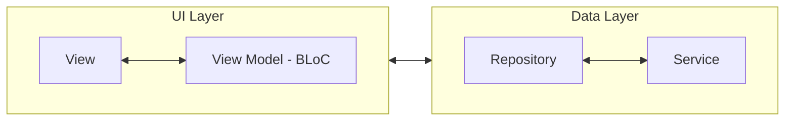
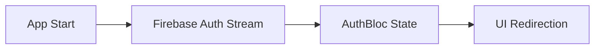
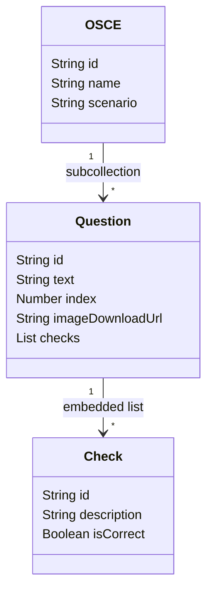

# Flashpedz – Smart Flashcards and OSCE Tests

Flashpedz is a mobile application designed to help medical students learn more effectively.

The two main features of the application are:
- Spaced repetition learning with flashcards
- OSCE tests

The application also includes an admin panel, allowing administrators to create new flashcard packs and OSCE tests,
as well as manage flashcards through a reporting system.

Both free and paid flashcard packs and OSCE tests are available.
Users must purchase a monthly subscription to access paid content.

---

# Table of Contents
- [Flashpedz – Smart Flashcards and OSCE Tests](#flashpedz--smart-flashcards-and-osce-tests)
- [Table of Contents](#table-of-contents)
- [System Architecture](#system-architecture)
  - [Important Note](#important-note)
- [How to Run (Production – Mobile Recommended)](#how-to-run-production--mobile-recommended)
  - [Prerequisites](#prerequisites)
  - [Platform Recommendation](#platform-recommendation)
    - [Step 1. Clone the project](#step-1-clone-the-project)
    - [Step 2. Run the flutter application](#step-2-run-the-flutter-application)
- [Flutter Application Architecture](#flutter-application-architecture)
  - [Architecture Description](#architecture-description)
  - [Data Layer](#data-layer)
  - [UI Layer](#ui-layer)
- [Auth Session Management](#auth-session-management)
  - [Auth BLoC states](#auth-bloc-states)
  - [Auth State Flow](#auth-state-flow)
  - [Auth State Lifecycle](#auth-state-lifecycle)
  - [Sign Out Handling](#sign-out-handling)
- [User Profile Management](#user-profile-management)
- [How Does Spaced Repetition work with Flashcards?](#how-does-spaced-repetition-work-with-flashcards)
  - [What is spaced repetition?](#what-is-spaced-repetition)
  - [How is spaced repetition implemented in this project?](#how-is-spaced-repetition-implemented-in-this-project)
    - [Opening a Pack Starts the Flashcard Test](#opening-a-pack-starts-the-flashcard-test)
  - [Bookmark Test with Flashcards](#bookmark-test-with-flashcards)
  - [Custom Sessions with Flashcards](#custom-sessions-with-flashcards)
- [How OSCE Tests Work](#how-osce-tests-work)
  - [OSCE Database](#osce-database)
  - [How Users Interact with OSCE Tests](#how-users-interact-with-osce-tests)


---

# System Architecture


Firebase Cloud Functions are used for security-sensitive operations and backend logic that should not be executed on the client.

> Firebase system is composed of multiple managed services including authentication, database and storage, which together provide backend-as-a-service functionality.

> Algolia is connected to firebase system and it's used for fast text searching and filtering of data.

## Important Note

This repository does not contain backend microservices or Firebase infrastructure configuration,
only the **Flutter client application**.

---

# How to Run (Production – Mobile Recommended)

## Prerequisites
- Flutter SDK and its dependencies ([Install Guide](https://docs.flutter.dev/install))
- A mobile device (physical or emulated)
- Firebase project configuration (API keys and config files)

> TODO: Add instructions for setting up Firebase project configuration

## Platform Recommendation

The production flavour is **intended and tested primarily for mobile platforms (Android and iOS)**.
Running the application on an Android or iOS device (emulator or physical device) is **strongly recommended**.

### Step 1. Clone the project
```bash
git clone https://github.com/dile001/flashcards.git
cd flashcards
```

### Step 2. Run the flutter application
```bash
flutter run -t lib/main_prod.dart
```
This command:
- Uses main_prod.dart as the application entry point
- Runs the app with production configuration (Firebase, API endpoints, etc.)

> A development flavour exists, but it is currently unstable and not recommended for use.

---

# Flutter Application Architecture

We adopted an **MVVM-like architecture** for this project.
This decision proved effective as the codebase grew rapidly.



> For more detailed explanation, check [Flutter Guide](https://docs.flutter.dev/app-architecture/guide)


## Architecture Description

Each layer has its own set of classes and is connected using **Dependency Injection**
(via the *Provider* package).

The dependency direction between layers is illustrated by the arrows in the diagram.

- A **Repository** can depend on multiple *Services*
- A **BLoC (ViewModel)** can depend on multiple *Repositories*
- Each **View** is associated with exactly one dedicated **ViewModel**
- A **ViewModel** belongs to a single **View**

The ViewModel layer is implemented using the **BLoC** pattern to manage state and business logic.


## Data Layer

The **Data Layer** provides an abstraction over all data sources used by the application, including:

- **Firestore data models** – each database collection has its own corresponding _Service_ and _Repository_ implementation
- **Firebase Authentication** – responsible for managing user sessions
- **Firebase Storage** – responsible for reading from and writing to cloud storage in a consistent and organized format
- **Algolia Search** – abstraction layer for performing full-text search and filtering on database models
- **Local Storage**, etc.

**Services** are responsible for calling external APIs and isolating those calls behind well-defined functions.  
**Repositories** use injected *Services* and encapsulate business logic related to data handling.

This layer is located under: ```lib/data```

Each repository usually has a corresponding Domain Model.
For example, PackRepository methods typically return instances of the Pack domain model.
Domain models are located under: ```lib/domain/models```

Services work with DTO (Data Transfer Object) classes, which represent data structures returned by external APIs.
These DTOs are located under: ```lib/services/api/dto```

Services usually return DTO instances, which are then converted by repositories into domain model objects.

## UI Layer

The **UI Layer** is responsible for rendering Flutter UI components and managing UI-related business logic.

UI business logic is implemented using the **BLoC** package.

Each **View** (page, popup dialog, bottom sheet, etc.) has its own dedicated **ViewModel / BLoC** responsible for handling the state and logic of that view.

The **BLoC** layer is under ```lib/bloc```.

The **View** layer is under ```lib/ui```

The View layer uses the **auto_route** package for navigation and routing.

---

# Auth Session Management

**Firebase Authentication** is an external service responsible for storing and managing user sessions.

The application uses a **global `AuthBloc`** to manage authentication-related UI state and determine whether
certain content should be accessible based on the user's authentication status.

“Global” means that this BLoC is injected directly into Flutter’s **context** using the *Provider* package,
which allows the authentication state to be accessed anywhere in the **View layer**.

## Auth BLoC states

The `AuthBloc` can have the following states:

- **Loading** – The application is waiting for an asynchronous authentication operation to complete
- **Unauthenticated** – The user is not logged in (or the session has ended) and is redirected to the login page
- **Authenticated** – The user is logged in and is redirected to the home page
- **VerifyEmailPending** – The user has registered but has not verified their email address.
Email verification is required before the user can access the application, and the user is redirected
to the email verification page

## Auth State Flow

The `AuthBloc` states change based on authentication streams provided by the Firebase Authentication service.
When the application starts, it subscribes to these streams and reacts to state changes by redirecting
the user to the appropriate page.

When a user creates a new account, a corresponding document is created in the `users` collection in Firestore,
based on the information provided during registration.

## Auth State Lifecycle



## Sign Out Handling

Users can be logged out for multiple reasons. To handle this, the application stores a
**sign-out reason** inside the `Unauthenticated` state.

Based on the sign-out reason, the user is redirected to an appropriate screen. Examples include:

- Manual logout → redirect to the login page
- JWT token expiration → display a popup informing the user
- Account deletion → redirect to the "goodbye" page
- Email update → redirect to the email verification page

---

# User Profile Management

Similar to **Auth Session Management**, the application uses a global `ProfileReaderCubit`
(a Cubit is a simplified version of a BLoC) that is injected into Flutter’s context and is accessible
from anywhere within the **View layer**.

This Cubit has the following states:

- **Loading** – The user profile is currently being loaded
- **Loaded** – The user profile has been successfully loaded and stored in the state
- **Error** – An error occurred while fetching or processing the user profile

---

# How Does Spaced Repetition work with Flashcards?

## What is spaced repetition?
**Spaced repetition** is a learning technique based on reviewing information at increasing time intervals to improve long-term memory retention.

Instead of reviewing flashcards at random or all at once, spaced repetition schedules each card to reappear just before the learner is **likely to forget it**. This timing strengthens memory recall and reduces the total number of reviews needed.

In flashcard systems, spaced repetition works as follows:

- Each flashcard has a review interval
- Cards answered correctly are shown less frequently over time
- Cards answered incorrectly are shown more often
- Review intervals grow progressively (for example: 1 day → 3 days → 7 days → 14 days)

By focusing more on difficult cards and less on well-known ones, spaced repetition makes learning more efficient and helps transfer knowledge from short-term to long-term memory.

## How is spaced repetition implemented in this project?
We use an open-source library that implements the **FSRS** algorithm. It is important to understand how this library works:
- It uses `Card` objects to store information for **one flashcard per user**
- Each `Card` object contains information about the learning state of a flashcard, including the **due date** — the date when this flashcard should ideally be reviewed again
- When a flashcard is shown to the user, they indicate how difficult it was for them to recall the information, choosing from: `again`, `hard`, `good`, `easy`
- Based on the user input and the current `Card` object, the library generates a new `Card` object with updated learning information and a new **due date**

Since the core of the library is the `Card` object, we create a **many-to-many (N-N) relationship** between the **flashcards** and **users** collections. To handle this relationship, we use a dedicated collection: `fcp_data` (**f**lash**c**ard-**p**rofile **data**).

This collection is used for multiple purposes:
- storing FSRS algorithm data for each flashcard-user pair
- bookmarking flashcards
- ignoring flashcards
- preloading flashcard information with snapshots
- and other flashcard-related features

### Opening a Pack Starts the Flashcard Test

- When a user opens a pack, we try to find **80% of flashcards** from that pack that they previously interacted with, and **20% of flashcards** that the user has never seen. We limit the number of flashcards per test session (the user can change this number in settings).
- If there are not enough old or new flashcards, we replace them. For example, if there are not enough new cards, we will grab more old cards to fill the target number of cards per session.

When the test starts, flashcards are shown one by one:
- The **question** is displayed first.
- After tapping the **reveal** button, the **answer** appears.
- The user can then rate how difficult the question was.
- Using the old ```Card``` object pulled from the database at the start of the test and the user's rating, we generate new ```Card``` data.
- This new data is then written back to the ```fcp_data``` collection.
- The next question is shown, and the cycle continues.

When a user completes all flashcards from the test session, they are given the option to continue practicing from this pack indefinitely.

This option pulls flashcards in the same way as before, in **batches of 20**.

## Bookmark Test with Flashcards

Users can **bookmark flashcards**, and this information is stored in the ```fcp_data``` collection.

Users can review bookmarked flashcards and also start a **"bookmark test"**.

This test grabs all flashcards that are **due for review** and **bookmarked**. The rest of the functionality is the same as the standard test described above.

## Custom Sessions with Flashcards

Users have the option to create their own **custom test** with flashcard packs. They can choose multiple packs, filter which flashcards to include or exclude, and generate a custom test based on these selections.

It works like this:
- The user selects the packs they want to combine.
- Based on those packs, they can choose to include **all cards**, **seen cards**, **bookmarked cards**, or **ignored cards only**.
- They can also include/exclude certain types of cards based on **tags**. Each card contains tags, and the user can select which tags to include or exclude.
- Finally, the user enters the number of cards they want to include in their custom session.

**Note on the number of cards per session:** On the last step of creating a custom session, the user enters the number of cards they want. Firestore has limited querying capabilities, so we cannot always accurately calculate how many cards will match the chosen filters. We inform the user that the resulting custom session may contain **fewer flashcards** than originally requested.

A **Firebase Cloud Function** is then called with the entered parameters to create the custom session. We use a cloud function for this because performing such a complex read and filter operation on the client side would put too much strain on it.

---

# How OSCE Tests Work

## OSCE Database



> The `OSCE` entity is stored as a document inside the **osces** collection.  
Each `OSCE` document contains a **questions** subcollection, where each document represents a single question.

> A `Question` document includes a `checks` field, which is an array of embedded objects representing evaluation criteria.  
`Check` objects are not stored as a separate collection, but as a nested list inside the `Question` document.

## How Users Interact with OSCE Tests

1. User opens an OSCE test.
2. The OSCE **name** and **scenario** are displayed.
3. User clicks **Start test**. The test starts and lasts a maximum of **10 minutes**.
4. Question **text** with an optional **image** is shown.
5. When the **reveal** button is clicked, the **checks** for that question are displayed, and the button becomes **Next**.
6. Clicking **Next** shows a new question, and the cycle continues from step 4.
7. Users can freely navigate to previous questions to mark or unmark checks.
8. When the last question is finished, or the timer runs out, the **results** are shown for this test.

On the results screen, users can review their previous results for this OSCE.  

Users can also access **all results** for OSCE tests they have taken.
